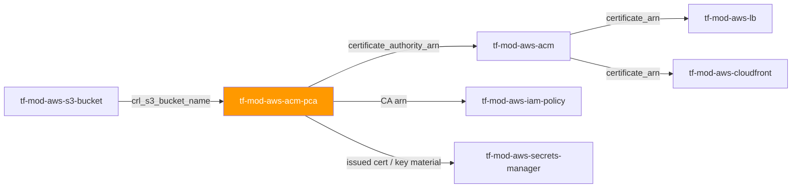
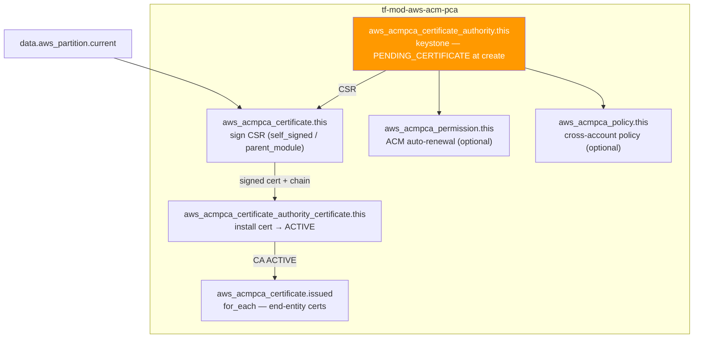

# 🟧 AWS **Private CA (ACM PCA)** Terraform Module

> **A secure-by-default AWS Private Certificate Authority — the full activation state machine (CSR → sign → install → ACTIVE), FIPS 140-2 Level 3 key storage, CRL/OCSP revocation, ACM auto-renewal permission, and cross-account resource policy, all from one module call.** Built for the AWS provider **v6.x**.


---

## 🧩 Overview

- 🏛️ Creates an **AWS Private Certificate Authority** (`aws_acmpca_certificate_authority`) — a `ROOT` trust anchor or a `SUBORDINATE` CA.
- 🔗 Models the **CA activation two-step** as explicit resources — issue a signed certificate from the CSR (`aws_acmpca_certificate`), then install it (`aws_acmpca_certificate_authority_certificate`) to flip the CA from `PENDING_CERTIFICATE` to **`ACTIVE`**.
- ✍️ Supports **three signing paths** via `activation.mode`: `self_signed` (root), `parent_module` (subordinate signed by a sibling/parent CA), and `external` (offline/enterprise parent supplies the signed PEM).
- 🔐 **FIPS 140-2 Level 3** key storage by default — the highest compliance tier; private key material never leaves the AWS/CloudHSM boundary.
- 🚫 **Revocation-aware** — CRL enabled by default when a bucket is supplied, with the CRL object ACL forced to `BUCKET_OWNER_FULL_CONTROL` (never public); optional OCSP.
- 🔄 Optional **ACM auto-renewal permission** (`aws_acmpca_permission`) so ACM-managed private certificates backed by this CA renew themselves.
- 🌐 Optional **cross-account resource policy** (`aws_acmpca_policy`) and a **child collection** of end-entity certificates (`for_each`).

> 💡 **Why it matters:** a private CA is the trust root for internal TLS across the estate. Left in `PENDING_CERTIFICATE` it silently issues nothing; issued with a public CRL ACL it leaks metadata. This module makes the *activated, FIPS-Level-3, non-public-CRL* posture the default, so internal mTLS and ACM-backed certificates work on the first apply without hand-wiring the activation state machine in every root module.

---

## ❤️ Support this project

If these Terraform modules have been helpful to you or your organization, I'd appreciate your support in any of the following ways:

- ⭐ **Star this repository** to help others discover this Terraform module.
- 🤝 **Connect with me on LinkedIn:** [linkedin.com/in/microsoftexpert](https://www.linkedin.com/in/microsoftexpert)
- ☕ **Buy me a coffee:** [buymeacoffee.com/microsoftexpert](https://buymeacoffee.com/microsoftexpert)

Whether it's a star, a professional connection, or a coffee, every gesture helps keep these modules actively maintained and continually improving. Thank you for being part of the community!

---

## 🗺️ Where this fits in the family



ACM PCA **consumes** only an existing CRL S3 bucket (by name) and, for subordinates, a parent CA ARN. It is **consumed** by `tf-mod-aws-acm` (as `certificate_authority_arn` for private, auto-renewing certificates), by IAM policy modules (scoping issuance rights to the CA ARN), and by any subordinate `tf-mod-aws-acm-pca` instance that names it as a parent.

---

## 🧬 What this module builds



| Resource | Role | Created when |
|---|---|---|
| `aws_acmpca_certificate_authority.this` | Keystone — the private CA (created in `PENDING_CERTIFICATE`) | Always |
| `aws_acmpca_certificate.this` | Signs the CA's own CSR (root self-sign or subordinate parent-sign) | `activation.mode ∈ {self_signed, parent_module}` |
| `aws_acmpca_certificate_authority_certificate.this` | Installs the signed cert onto the CA → **ACTIVE** | `activation` set (and, for `external`, once `signed_certificate` is supplied) |
| `aws_acmpca_certificate.issued` | End-entity certificates issued off the CA (`for_each`) | `issued_certificates` non-empty |
| `aws_acmpca_permission.this` | Grants `acm.amazonaws.com` the ACM auto-renewal actions | `create_acm_service_permission = true` |
| `aws_acmpca_policy.this` | Resource-based cross-account issuance policy | `policy != null` |

> ℹ️ Activation is modeled as **three distinct resources** (create / sign / install) that mirror the AWS API's own three-call model — so `terraform plan` shows exactly which phase of activation a change affects. Collapsing them would hide the CSR-signing dependency that defines this resource family.

---

## ✅ Provider / Versions

| Requirement | Version |
|---|---|
| Terraform | `>= 1.12.0` |
| `hashicorp/aws` | `>= 6.0, < 7.0` |

The module inherits a single, caller-configured `aws` provider (no `configuration_aliases`). ACM PCA is a **regional** service — set the Region in the caller's provider block.

---

## 🔑 Required IAM Permissions

The Terraform identity needs the following actions (least-privilege; scope to the CA ARN where possible — `acm-pca:CreateCertificateAuthority` cannot be scoped as no ARN exists yet).

| Action | Required for | Notes |
|---|---|---|
| `acm-pca:CreateCertificateAuthority`, `acm-pca:DescribeCertificateAuthority`, `acm-pca:UpdateCertificateAuthority`, `acm-pca:DeleteCertificateAuthority`, `acm-pca:ListCertificateAuthorities` | CA lifecycle | `Create` cannot be resource-scoped |
| `acm-pca:GetCertificateAuthorityCsr` | Reading the CSR exposed via `certificate_signing_request` | — |
| `acm-pca:IssueCertificate`, `acm-pca:GetCertificate` | Signing the CA's CSR and issuing end-entity certs | Root self-sign, subordinate sign, `issued_certificates` |
| `acm-pca:ImportCertificateAuthorityCertificate` | Installing the signed certificate (the activation step) | — |
| `acm-pca:GetCertificateAuthorityCertificate` | Reading back the installed CA certificate/chain | — |
| `acm-pca:CreatePermission`, `acm-pca:DeletePermission`, `acm-pca:ListPermissions` | `aws_acmpca_permission` (ACM auto-renewal grant) | Only when `create_acm_service_permission = true` |
| `acm-pca:PutPolicy`, `acm-pca:GetPolicy`, `acm-pca:DeletePolicy` | `aws_acmpca_policy` (resource-based policy) | Only when `policy != null` |
| `acm-pca:TagCertificateAuthority`, `acm-pca:UntagCertificateAuthority`, `acm-pca:ListTags` | Tagging | — |
| `s3:GetBucketAcl`, `s3:GetBucketLocation` | Validating CRL bucket accessibility at CA-create time | Only when `revocation.crl.enabled = true` |
| `kms:Decrypt`, `kms:GenerateDataKey` (conditional) | Only if the CRL bucket uses SSE-KMS with a restrictive CMK key policy | Granted on the **KMS key policy**, not by this module |

> ℹ️ **No `iam:PassRole` is required** — ACM PCA has no pass-role dependency (unlike, e.g., RDS monitoring roles).
>
> ⚠️ The CRL **write** grant (`s3:PutObject`, `s3:PutObjectAcl`) belongs on the **bucket policy** for the `acm-pca.amazonaws.com` service principal — not on the Terraform identity. See AWS Prerequisites.

---

## 📋 AWS Prerequisites

- **Service-linked role:** none required for ACM PCA.
- **CA activation is a hard AWS API constraint,** not a Terraform limitation — a created CA sits in `PENDING_CERTIFICATE` until a signed certificate is installed. This module models all three calls (see [Architecture Notes](#-architecture-notes)).
- **CRL storage** (opt-in, default-recommended): when `revocation.crl.enabled = true`, the target S3 bucket must already exist **and** carry a bucket policy granting `acm-pca.amazonaws.com` the actions `s3:GetBucketAcl`, `s3:GetBucketLocation`, `s3:PutObject`, and `s3:PutObjectAcl`. AWS validates this at CA-creation time, so the bucket + policy must be created and `depends_on`-ordered **ahead** of the CA.
- **Key storage security standard region availability:** `FIPS_140_2_LEVEL_3_OR_HIGHER` (the default) is not available in every Region. Confirm support for the target Region in the AWS Private CA data-protection docs, or fall back to `FIPS_140_2_LEVEL_2_OR_HIGHER`.
- **Audit reports are NOT a Terraform-managed resource.** `CreateCertificateAuthorityAuditReport` is an on-demand API action against an already-active CA — implement it as an operational runbook step (scheduled Lambda/EventBridge or a pipeline job), not a standing configuration here.
- **Soft-delete:** `permanent_deletion_time_in_days` (7–30, default 30) governs how long a deleted CA remains restorable. A CA cannot be permanently deleted immediately, and can only be disabled from an `ACTIVE` state.
- **Quotas** (Service Quotas, raisable): a small default number of private CAs per account/Region (historically 10; `GENERAL_PURPOSE` and `SHORT_LIVED_CERTIFICATE` tracked separately), plus a certificate-issuance TPS limit — request increases before large-scale rollouts.

---

## 📁 Module Structure

```text
tf-mod-aws-acm-pca/
├── providers.tf # required_providers (aws >= 6.0, < 7.0); no provider block
├── variables.tf # name, CA config, type, usage/key-storage, revocation, activation, issued certs, permission, policy, tags
├── main.tf # CA + sign + install + issued (for_each) + permission + policy
├── outputs.tf # id, arn, csr, certificate(+chain), not_before/after, serial, issued_*, tags_all
├── README.md # this file
└── SCOPE.md # in/out-of-scope, IAM, prerequisites, gotchas, design decisions
```

---

## ⚙️ Quick Start

Smallest working call — a self-signed **root** CA, activated in one apply:

```hcl
module "root_ca" {
  source = "git::https://github.com/microsoftexpert/tf-mod-aws-acm-pca?ref=v1.0.0"

  name = "casey-internal-root"
  type = "ROOT"

  certificate_authority_configuration = {
    key_algorithm     = "RSA_2048"
    signing_algorithm = "SHA256WITHRSA"
    subject = {
      common_name  = "Internal Root CA"
      organization = "Casey Wood"
      country      = "US"
    }
  }

  # Activate in-module: the root self-signs its own CSR, then installs it (→ ACTIVE).
  activation = {
    mode     = "self_signed"
    validity = { type = "YEARS", value = 10 }
  }

  tags = { Environment = "prod", DataClass = "internal" }
}

# Wire the CA ARN into an ACM private certificate:
# certificate_authority_arn = module.root_ca.arn
```

> ⚠️ Always pin the source with `?ref=v1.0.0` — never a branch.

---

## 🔌 Cross-Module Contract

### Consumes

| Input | Type | Source module |
|---|---|---|
| `revocation.crl.s3_bucket_name` | `string` (bucket **name**, not ARN) | `tf-mod-aws-s3-bucket` (`.id`) |
| `activation.parent_certificate_authority_arn` | `string` (CA ARN) | a parent `tf-mod-aws-acm-pca` instance |
| `activation.signed_certificate` / `certificate_chain` | `string` (PEM) | caller-supplied (offline/enterprise root) — not a sibling module |
| `policy` | `string` (JSON) | `tf-mod-aws-iam-policy` document or `jsonencode` |

> This module deliberately does **not** consume a KMS key — ACM PCA manages its own HSM-backed key material and exposes no `kms_key_id` argument. See [Architecture Notes](#-architecture-notes).

### Emits

| Output | Description | Consumed by |
|---|---|---|
| `id` | CA ARN (identical to `arn`) | Any module/policy referencing this CA |
| `arn` | CA ARN — `arn:<partition>:acm-pca:<region>:<account>:certificate-authority/<uuid>` | `tf-mod-aws-acm` (`certificate_authority_arn`), `tf-mod-aws-iam-policy`, subordinate CA `parent_certificate_authority_arn` |
| `certificate_signing_request` | Base64 PEM CSR for the CA's own cert | External signing workflows; the in-module self/parent signing flow |
| `certificate` / `certificate_chain` | Installed CA certificate (and chain, subordinate only) | Audit / trust-chain verification |
| `not_before` / `not_after` / `serial` | CA validity window and serial (post-activation) | Certificate-lifecycle monitoring |
| `issued_certificate_arns` / `issued_certificates` | Map of end-entity cert ARNs (and PEM material) | Workload TLS config, `tf-mod-aws-secrets-manager` |
| `acm_permission_policy` | IAM policy JSON of the ACM permission (when created) | Audit |
| `tags_all` | All tags incl. provider `default_tags` | Governance / audit |

---

## 📚 Example Library

<details>
<summary><strong>1 · Minimal — self-signed root CA (activated in one apply)</strong></summary>

```hcl
module "root_ca" {
  source = "git::https://github.com/microsoftexpert/tf-mod-aws-acm-pca?ref=v1.0.0"

  name = "casey-internal-root"
  type = "ROOT"

  certificate_authority_configuration = {
    key_algorithm     = "RSA_2048"
    signing_algorithm = "SHA256WITHRSA"
    subject           = { common_name = "Internal Root CA" }
  }

  activation = { mode = "self_signed" }
}
```
</details>

<details>
<summary><strong>2 · With tags (merges with provider <code>default_tags</code>)</strong></summary>

```hcl
provider "aws" {
  region = "us-east-1"
  default_tags {
    tags = {
      ManagedBy = "Terraform"
      Owner     = "platform-team"
    }
  }
}

module "root_ca" {
  source = "git::https://github.com/microsoftexpert/tf-mod-aws-acm-pca?ref=v1.0.0"

  name = "casey-internal-root"
  type = "ROOT"

  certificate_authority_configuration = {
    key_algorithm     = "EC_prime256v1"
    signing_algorithm = "SHA256WITHECDSA"
    subject           = { common_name = "Internal Root CA" }
  }
  activation = { mode = "self_signed" }

  # Resource tags MERGE with default_tags; resource tags win on key conflict.
  # A `Name` key here would override the default Name = var.name.
  tags = {
    Environment = "prod"
    DataClass   = "internal"
  }
}

# module.root_ca.tags_all == { Name, ManagedBy, Owner, Environment, DataClass }
```
</details>

<details>
<summary><strong>3 · Root CA with CRL revocation (wired to an S3 bucket)</strong></summary>

```hcl
# The CRL bucket + a bucket policy for acm-pca.amazonaws.com must exist first.
module "crl_bucket" {
  source      = "git::https://github.com/microsoftexpert/tf-mod-aws-s3-bucket?ref=v1.0.0"
  bucket_name = "casey-pca-crl"
  #... attach a bucket policy granting acm-pca.amazonaws.com
  # s3:PutObject / s3:PutObjectAcl / s3:GetBucketAcl / s3:GetBucketLocation...
}

module "root_ca" {
  source = "git::https://github.com/microsoftexpert/tf-mod-aws-acm-pca?ref=v1.0.0"

  name = "casey-internal-root"
  type = "ROOT"

  certificate_authority_configuration = {
    key_algorithm     = "RSA_2048"
    signing_algorithm = "SHA256WITHRSA"
    subject           = { common_name = "Internal Root CA" }
  }

  revocation = {
    crl = {
      enabled            = true
      s3_bucket_name     = module.crl_bucket.id # bare bucket NAME
      expiration_in_days = 7
      # s3_object_acl defaults to BUCKET_OWNER_FULL_CONTROL (secure)
    }
  }

  activation = { mode = "self_signed" }

  # AWS validates CRL bucket writability at CA-create time — order it explicitly:
  depends_on = [module.crl_bucket]
}
```
</details>

<details>
<summary><strong>4 · Subordinate CA signed by a parent module (two-tier hierarchy)</strong></summary>

```hcl
# Parent root CA (must be ACTIVE before the subordinate is applied).
module "root_ca" {
  source = "git::https://github.com/microsoftexpert/tf-mod-aws-acm-pca?ref=v1.0.0"

  name = "casey-internal-root"
  type = "ROOT"
  certificate_authority_configuration = {
    key_algorithm     = "RSA_4096"
    signing_algorithm = "SHA512WITHRSA"
    subject           = { common_name = "Internal Root CA" }
  }
  activation = { mode = "self_signed", validity = { type = "YEARS", value = 15 } }
}

# Subordinate issuing CA — its CSR is signed by the root above.
module "issuing_ca" {
  source = "git::https://github.com/microsoftexpert/tf-mod-aws-acm-pca?ref=v1.0.0"

  name = "casey-issuing"
  type = "SUBORDINATE"
  certificate_authority_configuration = {
    key_algorithm     = "RSA_2048"
    signing_algorithm = "SHA256WITHRSA"
    subject           = { common_name = "Issuing CA" }
  }

  activation = {
    mode                             = "parent_module"
    parent_certificate_authority_arn = module.root_ca.arn
    validity                         = { type = "YEARS", value = 5 }
  }
}
```
</details>

<details>
<summary><strong>5 · Subordinate CA signed by an EXTERNAL/offline root (PEM supplied)</strong></summary>

```hcl
# 1) First apply: create the CA with activation omitted, export the CSR:
# terraform output -raw certificate_signing_request > sub.csr
# Have the offline enterprise root sign sub.csr, producing sub.pem + chain.pem.
# 2) Second apply: supply the signed PEM to complete activation.
module "issuing_ca" {
  source = "git::https://github.com/microsoftexpert/tf-mod-aws-acm-pca?ref=v1.0.0"

  name = "casey-enterprise-issuing"
  type = "SUBORDINATE"
  certificate_authority_configuration = {
    key_algorithm     = "RSA_2048"
    signing_algorithm = "SHA256WITHRSA"
    subject           = { common_name = "Enterprise Issuing CA" }
  }

  activation = {
    mode               = "external"
    signed_certificate = file("sub.pem")   # produced by the offline root
    certificate_chain  = file("chain.pem") # REQUIRED for an external subordinate
  }
}
```
</details>

<details>
<summary><strong>6 · ACM auto-renewal permission (private certs that renew themselves)</strong></summary>

```hcl
module "issuing_ca" {
  source = "git::https://github.com/microsoftexpert/tf-mod-aws-acm-pca?ref=v1.0.0"

  name = "casey-issuing"
  type = "SUBORDINATE"
  certificate_authority_configuration = {
    key_algorithm     = "RSA_2048"
    signing_algorithm = "SHA256WITHRSA"
    subject           = { common_name = "Issuing CA" }
  }
  activation = {
    mode                             = "parent_module"
    parent_certificate_authority_arn = module.root_ca.arn
  }

  # Let ACM issue + auto-renew private certificates backed by this CA.
  create_acm_service_permission = true
}

# An ACM private certificate that renews itself:
# module "cert" {
# source = ".../tf-mod-aws-acm?ref=v1.0.0"
# domain_name = "api.internal.casey"
# certificate_authority_arn = module.issuing_ca.arn
# }
```
</details>

<details>
<summary><strong>7 · End-entity certificates issued directly off the CA (<code>for_each</code>)</strong></summary>

```hcl
module "issuing_ca" {
  source = "git::https://github.com/microsoftexpert/tf-mod-aws-acm-pca?ref=v1.0.0"

  name = "casey-issuing"
  type = "SUBORDINATE"
  certificate_authority_configuration = {
    key_algorithm     = "RSA_2048"
    signing_algorithm = "SHA256WITHRSA"
    subject           = { common_name = "Issuing CA" }
  }
  activation = {
    mode                             = "parent_module"
    parent_certificate_authority_arn = module.root_ca.arn
  }

  # Ad-hoc leaf certs (NOT renewable — replace, don't renew).
  issued_certificates = {
    app-mtls = {
      certificate_signing_request = file("app.csr")
      validity                    = { type = "DAYS", value = 90 }
    }
    device-01 = {
      certificate_signing_request = file("device01.csr")
      template_arn                = "arn:aws:acm-pca:::template/EndEntityCertificate/V1"
      validity                    = { type = "MONTHS", value = 6 }
    }
  }
}
```
</details>

<details>
<summary><strong>8 · Cross-account issuance via a resource policy</strong></summary>

```hcl
data "aws_iam_policy_document" "share" {
  statement {
    sid       = "AllowCrossAccountIssuance"
    effect    = "Allow"
    actions   = ["acm-pca:IssueCertificate", "acm-pca:GetCertificate", "acm-pca:DescribeCertificateAuthority"]
    resources = ["*"]
    principals {
      type        = "AWS"
      identifiers = ["arn:aws:iam::444455556666:root"]
    }
  }
}

module "issuing_ca" {
  source = "git::https://github.com/microsoftexpert/tf-mod-aws-acm-pca?ref=v1.0.0"

  name = "casey-shared-issuing"
  type = "SUBORDINATE"
  certificate_authority_configuration = {
    key_algorithm     = "RSA_2048"
    signing_algorithm = "SHA256WITHRSA"
    subject           = { common_name = "Shared Issuing CA" }
  }
  activation = {
    mode                             = "parent_module"
    parent_certificate_authority_arn = module.root_ca.arn
  }

  policy = data.aws_iam_policy_document.share.json
}
```
</details>

<details>
<summary><strong>9 · OCSP revocation instead of / alongside CRL</strong></summary>

```hcl
module "issuing_ca" {
  source = "git::https://github.com/microsoftexpert/tf-mod-aws-acm-pca?ref=v1.0.0"

  name = "casey-issuing"
  type = "SUBORDINATE"
  certificate_authority_configuration = {
    key_algorithm     = "RSA_2048"
    signing_algorithm = "SHA256WITHRSA"
    subject           = { common_name = "Issuing CA" }
  }
  activation = {
    mode                             = "parent_module"
    parent_certificate_authority_arn = module.root_ca.arn
  }

  revocation = {
    ocsp = {
      enabled           = true
      ocsp_custom_cname = "ocsp.internal.casey"
    }
  }
}
```
</details>

<details>
<summary><strong>10 · Public CRL ACL (external relying parties) — documented EXCEPTION</strong></summary>

```hcl
# ⚠️ Overrides the secure default. The CRL object becomes publicly readable.
# Only for CAs whose CRL must be fetchable by external parties. Document it.
module "public_facing_ca" {
  source = "git::https://github.com/microsoftexpert/tf-mod-aws-acm-pca?ref=v1.0.0"

  name = "casey-public-issuing"
  type = "SUBORDINATE"
  certificate_authority_configuration = {
    key_algorithm     = "RSA_2048"
    signing_algorithm = "SHA256WITHRSA"
    subject           = { common_name = "Public Issuing CA" }
  }
  activation = {
    mode                             = "parent_module"
    parent_certificate_authority_arn = module.root_ca.arn
  }

  revocation = {
    crl = {
      enabled        = true
      s3_bucket_name = module.crl_bucket.id
      s3_object_acl  = "PUBLIC_READ" # OPT-OUT of the secure default
    }
  }
}
```
</details>

<details>
<summary><strong>11 · Short-lived certificate mode (no revocation infrastructure) — EXCEPTION</strong></summary>

```hcl
# ⚠️ Caps issued-certificate validity at 7 days and changes billing.
# Trades revocation tooling for expiry-based invalidation. Document the tradeoff.
module "short_lived_ca" {
  source = "git::https://github.com/microsoftexpert/tf-mod-aws-acm-pca?ref=v1.0.0"

  name       = "casey-shortlived-issuing"
  type       = "SUBORDINATE"
  usage_mode = "SHORT_LIVED_CERTIFICATE" # OPT-OUT of GENERAL_PURPOSE
  certificate_authority_configuration = {
    key_algorithm     = "EC_prime256v1"
    signing_algorithm = "SHA256WITHECDSA"
    subject           = { common_name = "Short-Lived Issuing CA" }
  }
  activation = {
    mode                             = "parent_module"
    parent_certificate_authority_arn = module.root_ca.arn
  }
  # No revocation block — appropriate here because certs expire in ≤ 7 days.
}
```
</details>

<details>
<summary><strong>12 · FIPS Level-2 fallback (Region without Level-3) — documented EXCEPTION</strong></summary>

```hcl
module "root_ca" {
  source = "git::https://github.com/microsoftexpert/tf-mod-aws-acm-pca?ref=v1.0.0"

  name = "casey-internal-root"
  type = "ROOT"

  # OPT-OUT: only where the target Region lacks FIPS 140-2 Level-3 support.
  key_storage_security_standard = "FIPS_140_2_LEVEL_2_OR_HIGHER"

  certificate_authority_configuration = {
    key_algorithm     = "RSA_2048"
    signing_algorithm = "SHA256WITHRSA"
    subject           = { common_name = "Internal Root CA" }
  }
  activation = { mode = "self_signed" }
}
```
</details>

<details>
<summary><strong>13 · CA left un-activated (activation handled out-of-band) — ADVANCED</strong></summary>

```hcl
# ⚠️ activation = null leaves the CA in PENDING_CERTIFICATE — it issues NOTHING
# until you install a signed certificate yourself. Only use when the signing
# ceremony is orchestrated entirely outside Terraform.
module "pending_ca" {
  source = "git::https://github.com/microsoftexpert/tf-mod-aws-acm-pca?ref=v1.0.0"

  name = "casey-manual-root"
  type = "ROOT"
  certificate_authority_configuration = {
    key_algorithm     = "RSA_2048"
    signing_algorithm = "SHA256WITHRSA"
    subject           = { common_name = "Manual Root CA" }
  }
  # activation intentionally omitted — export module.pending_ca.certificate_signing_request
}
```
</details>

<details>
<summary><strong>14 · End-to-end composition — S3 (CRL) → Private CA → ACM certificate → ALB (mandatory finale)</strong></summary>

```hcl
# 1) CRL bucket (a bucket policy for acm-pca.amazonaws.com is attached in the bucket module)
module "crl_bucket" {
  source      = "git::https://github.com/microsoftexpert/tf-mod-aws-s3-bucket?ref=v1.0.0"
  bucket_name = "casey-pca-crl"
}

# 2) Root CA — self-signed, revocation-enabled, FIPS Level 3
module "root_ca" {
  source = "git::https://github.com/microsoftexpert/tf-mod-aws-acm-pca?ref=v1.0.0"

  name = "casey-internal-root"
  type = "ROOT"
  certificate_authority_configuration = {
    key_algorithm     = "RSA_4096"
    signing_algorithm = "SHA512WITHRSA"
    subject           = { common_name = "Internal Root CA", organization = "Casey Wood" }
  }
  activation = { mode = "self_signed", validity = { type = "YEARS", value = 15 } }
  depends_on = [module.crl_bucket]
}

# 3) Subordinate issuing CA — signed by the root, ACM auto-renewal enabled
module "issuing_ca" {
  source = "git::https://github.com/microsoftexpert/tf-mod-aws-acm-pca?ref=v1.0.0"

  name = "casey-issuing"
  type = "SUBORDINATE"
  certificate_authority_configuration = {
    key_algorithm     = "RSA_2048"
    signing_algorithm = "SHA256WITHRSA"
    subject           = { common_name = "Issuing CA" }
  }
  activation = {
    mode                             = "parent_module"
    parent_certificate_authority_arn = module.root_ca.arn
  }
  revocation = {
    crl = { enabled = true, s3_bucket_name = module.crl_bucket.id }
  }
  create_acm_service_permission = true
  tags                          = { Environment = "prod", DataClass = "PII" }
}

# 4) An ACM private certificate that renews itself, fronting internal TLS
module "internal_cert" {
  source                    = "git::https://github.com/microsoftexpert/tf-mod-aws-acm?ref=v1.0.0"
  domain_name               = "api.internal.casey"
  certificate_authority_arn = module.issuing_ca.arn # private, auto-renewing
}

# 5) The ALB HTTPS listener uses the private certificate
module "alb" {
  source          = "git::https://github.com/microsoftexpert/tf-mod-aws-lb?ref=v1.0.0"
  name            = "internal-api"
  certificate_arn = module.internal_cert.arn
  #... vpc_id, subnet_ids, security_group...
}
```
</details>

---

## 📥 Inputs

> ℹ️ High-level grouping below; see `variables.tf` for full object schemas and validation.

- **Core / identity:** `name` (logical name → default `Name` tag), `certificate_authority_configuration` (**Required** — `key_algorithm`, `signing_algorithm`, `subject`; all FORCE-NEW), `type` (`ROOT`/`SUBORDINATE`, FORCE-NEW), `enabled`.
- **Compliance / lifecycle:** `usage_mode` (default `GENERAL_PURPOSE`), `key_storage_security_standard` (default `FIPS_140_2_LEVEL_3_OR_HIGHER`), `permanent_deletion_time_in_days` (default `30`).
- **Revocation:** `revocation` — nullable object with `crl { enabled, s3_bucket_name, expiration_in_days, custom_cname, s3_object_acl }` and `ocsp { enabled, ocsp_custom_cname }`.
- **Activation:** `activation` — nullable object with `mode` (`self_signed`/`parent_module`/`external`), `parent_certificate_authority_arn`, `signing_algorithm`, `template_arn`, `validity`, `signed_certificate`, `certificate_chain`.
- **Issuance:** `issued_certificates` — `map(object)` of end-entity certs (`for_each`).
- **Sharing:** `create_acm_service_permission`, `permission_source_account`, `policy` (JSON).
- **Universal:** `tags`.

---

## 🧾 Outputs

- `id` — CA ARN (identical to `arn`).
- `arn` — CA ARN (the canonical cross-resource reference).
- `certificate_signing_request` — base64 PEM CSR for the CA's own certificate.
- `certificate`, `certificate_chain` — installed CA certificate and chain (chain populated for subordinates post-activation).
- `not_before`, `not_after`, `serial` — CA validity window and serial; **populated only after activation**.
- `issued_certificate_arns` — map of `issued_certificates` key → cert ARN (empty when none).
- `issued_certificates` — map of key → `{ arn, certificate, certificate_chain }` (public PEM; not secret).
- `acm_permission_policy` — `try(..., null)`: the ACM permission's IAM policy JSON, or **null** when not created.
- `tags_all` — merged resource + provider `default_tags`.

---

## 🧠 Architecture Notes

- **ARN / id formats.**
 - CA ARN: `arn:<partition>:acm-pca:<region>:<account>:certificate-authority/<uuid>`
 - `id` **equals** `arn` on `aws_acmpca_certificate_authority` — the module emits both for consistency across the library.
- **The activation two-step.** Creating the CA leaves it in `PENDING_CERTIFICATE`; it cannot issue certificates until a signed certificate is installed. The module models AWS's three API calls as three resources:
 1. `aws_acmpca_certificate_authority.this` — creates the CA, exposes `certificate_signing_request`.
 2. `aws_acmpca_certificate.this` — signs the CSR (root self-sign → `certificate_authority_arn = this.arn`; subordinate → the parent's ARN). Resolved in a **single apply** — no cycle, since the CA never references the certificate.
 3. `aws_acmpca_certificate_authority_certificate.this` — installs the signed cert (and chain, for subordinates) → **ACTIVE**. `certificate_chain` is **required for SUBORDINATE, forbidden for ROOT**; the module sets it to `null` for root regardless of mode.
- **Force-new / immutable fields.** The entire `certificate_authority_configuration` (`key_algorithm`, `signing_algorithm`, every `subject.*`) and `type` are **FORCE-NEW** — there is no in-place key rotation or subject-DN change. "Rotating" a private CA means standing up a new CA and re-chaining beneath it.
- **No customer-managed KMS key.** `aws_acmpca_certificate_authority` exposes no `kms_key_id`/CMK argument — key material is HSM-backed and governed by `key_storage_security_standard`. Wiring a `tf-mod-aws-kms` ARN here fails `terraform validate` (unsupported argument). CMK encryption belongs on the **destination** (e.g. the CRL S3 bucket), not the CA.
- **`tags` ↔ `tags_all` ↔ `default_tags`.** Only `aws_acmpca_certificate_authority` is taggable; `aws_acmpca_certificate`, `_authority_certificate`, `_permission`, and `_policy` expose no `tags`. `var.tags` (merged with a default `Name = var.name`, which `var.tags` can override) flows to the CA; `tags_all` is the computed merge over provider `default_tags` (resource tags win).
- **`aws_acmpca_certificate` is not renewable.** Certificates issued via `issued_certificates` must be **replaced**, not renewed. For auto-renewal, wire `tf-mod-aws-acm`'s `certificate_authority_arn` (which is why `create_acm_service_permission` exists).
- **`aws_acmpca_permission.principal` accepts only `acm.amazonaws.com`.** Despite the resource name, it is not a general service-principal grant; cross-account sharing goes through `policy` (`aws_acmpca_policy`).
- **Destroy ordering.** Permissions/policy are torn down before the CA by the dependency graph. A CA must be disabled from `ACTIVE` before deletion; the provider handles the disable-then-delete, subject to the `permanent_deletion_time_in_days` soft-delete window. Deleting the CRL S3 bucket before the CA is removed can strand the CA — remove the CA first.
- **Region.** ACM PCA is **regional** — no us-east-1 global constraint (unlike CloudFront/WAFv2/ACM-for-CloudFront). The Region comes from the caller's provider.

---

## 🧱 Design Principles

Secure-by-default posture — each hardened default and the exact variable that relaxes it:

| Posture | Hardened default | Opt-out (variable) |
|---|---|---|
| Key storage compliance | `key_storage_security_standard = "FIPS_140_2_LEVEL_3_OR_HIGHER"` | `"FIPS_140_2_LEVEL_2_OR_HIGHER"` (only where a Region lacks Level-3) |
| CRL revocation | enabled by default when a bucket is supplied (`revocation.crl.enabled = true`) | `revocation.crl.enabled = false` / omit `revocation` (documented exception) |
| CRL object ACL | `s3_object_acl = "BUCKET_OWNER_FULL_CONTROL"` (overrides the provider's `PUBLIC_READ` default) | `"PUBLIC_READ"` for public-facing relying parties (document it) |
| CA usage mode | `usage_mode = "GENERAL_PURPOSE"` (full revocation tooling) | `"SHORT_LIVED_CERTIFICATE"` (7-day max validity, no revocation) |
| Soft-delete window | `permanent_deletion_time_in_days = 30` (max recovery) | lower toward the `7` minimum |
| Encryption at rest | always-on HSM-backed key material (platform guarantee) | **no opt-out surface** — not a module-configurable default |

Additional principles:
- **Activation is explicit, three resources.** The create / sign / install steps mirror the AWS API so `plan` reveals which activation phase a change touches.
- **`activation.mode` is a closed enum,** not inferred from which optional inputs are set — `plan` intent is explicit and mutually-exclusive combinations are enforced by `validation {}`.
- **End-entity certs are a `for_each` child collection,** separate from the singleton activation certificate (no `count`).
- **No customer-managed KMS input** — corrected against the live schema (the resource has no such argument), documented rather than silently dropped.

---

## 🚀 Runbook

```bash
terraform init -backend=false
terraform validate
terraform fmt -check

# plan/apply require valid AWS credentials (profile / SSO / OIDC) and a region:
terraform plan
terraform apply
terraform output
```

> ⚠️ Pin the module source with `?ref=v1.0.0` — never a branch.
> ℹ️ When `revocation.crl.enabled = true`, ensure the CRL bucket + `acm-pca.amazonaws.com` bucket policy exist first and `depends_on`-order them ahead of this module — AWS validates CRL writability at CA-create time.

---

## 🧪 Testing

- `terraform init -backend=false && terraform validate` — offline schema validation.
- `terraform fmt -check` — formatting gate.
- `terraform plan` against a sandbox account — confirm the CA plans in `PENDING_CERTIFICATE` and, with `activation` set, the sign + install resources plan in the same apply.
- After apply: `aws acm-pca describe-certificate-authority --certificate-authority-arn <arn>` should show `Status = ACTIVE`.
- With CRL enabled: confirm the first CRL object lands in the bucket and its ACL is **not** public.
- With `create_acm_service_permission = true`: `aws acm-pca list-permissions` shows the `acm.amazonaws.com` grant.

---

## 💬 Example Output

```text
Apply complete! Resources: 3 added, 0 changed, 0 destroyed.

Outputs:

arn = "arn:aws:acm-pca:us-east-1:111122223333:certificate-authority/1a2b3c4d-5e6f-7890-abcd-ef1234567890"
id = "arn:aws:acm-pca:us-east-1:111122223333:certificate-authority/1a2b3c4d-5e6f-7890-abcd-ef1234567890"
not_after = "2036-07-04T00:00:00Z"
not_before = "2026-07-04T00:00:00Z"
serial = "01:23:45:67:89:ab:cd:ef"
issued_certificate_arns = {}
tags_all = {
 "DataClass" = "internal"
 "Environment" = "prod"
 "Name" = "casey-internal-root"
}
```

---

## 🔍 Troubleshooting

- **CA stuck in `PENDING_CERTIFICATE` / issues nothing.** No certificate was installed. Set `activation` (`self_signed`/`parent_module`), or for `external` mode supply `signed_certificate`. A CA with `activation = null` is inert by design — this is the single most common ACM PCA foot-gun.
- **`external` mode applied but CA still pending.** `signed_certificate` was never supplied, so the install resource did not render. Export `certificate_signing_request`, complete the offline signing, then set `activation.signed_certificate` (+ `certificate_chain` for subordinates) and re-apply.
- **`InvalidStateException` / "not ACTIVE" issuing an end-entity cert or ACM cert.** The CA is not activated yet. `issued_certificates` `depends_on` the install step; for subordinates, the **parent** CA must itself be ACTIVE before this one is applied (strict cross-module ordering).
- **`certificate_chain` errors on install.** A ROOT must NOT supply a chain; a SUBORDINATE must. The module sets `null` for root automatically — check `type` matches your intent.
- **CRL create failure (`S3 bucket... access` / `Access denied`).** The bucket lacks the `acm-pca.amazonaws.com` bucket policy (`s3:PutObject`/`s3:PutObjectAcl`/`s3:GetBucketAcl`/`s3:GetBucketLocation`), or it wasn't created before the CA. Add the policy and `depends_on` the bucket.
- **Region lacks FIPS Level-3.** Create fails on `key_storage_security_standard = FIPS_140_2_LEVEL_3_OR_HIGHER` — fall back to `FIPS_140_2_LEVEL_2_OR_HIGHER` after confirming Region support.
- **Tag drift from `default_tags` overlap.** A key set in both `var.tags` and provider `default_tags` shows the resource value in `tags_all` (resource wins). If a plan keeps re-adding a tag, it is defined in both places — remove the duplicate. Note the module seeds a default `Name = var.name`.
- **Credential-chain failures.** `NoCredentialProviders` / `ExpiredToken` on plan/apply means no valid AWS credentials — set `AWS_PROFILE`, refresh SSO, or confirm the OIDC role assumption succeeded in CI.
- **IAM permission denials.** An `acm-pca:*` denial means the Terraform identity lacks the action — see [Required IAM Permissions](#-required-iam-permissions). Scope least-privilege; do not broaden to `*`.
- **Destroy hangs / soft-delete.** A CA is soft-deleted with a restoration window (`permanent_deletion_time_in_days`); it is not purged immediately. Deleting the CRL bucket before the CA can strand it — remove the CA first.

---

## 🔗 Related Docs

- Terraform Registry — `aws_acmpca_certificate_authority`, `aws_acmpca_certificate`, `aws_acmpca_certificate_authority_certificate`, `aws_acmpca_permission`, `aws_acmpca_policy`
- AWS Private CA User Guide — creating and activating a CA, certificate templates, CRL/OCSP revocation
- AWS Private CA — Storage and security compliance of AWS Private CA private keys (Region FIPS-level support)
- AWS Private CA — audit reports (`CreateCertificateAuthorityAuditReport`)
- module suite — `tf-mod-aws-acm`, `tf-mod-aws-s3-bucket`, `tf-mod-aws-iam-policy`, `tf-mod-aws-secrets-manager`, `tf-mod-aws-lb`

---

> 🧡 *"Infrastructure as Code should be standardized, consistent, and secure."*
